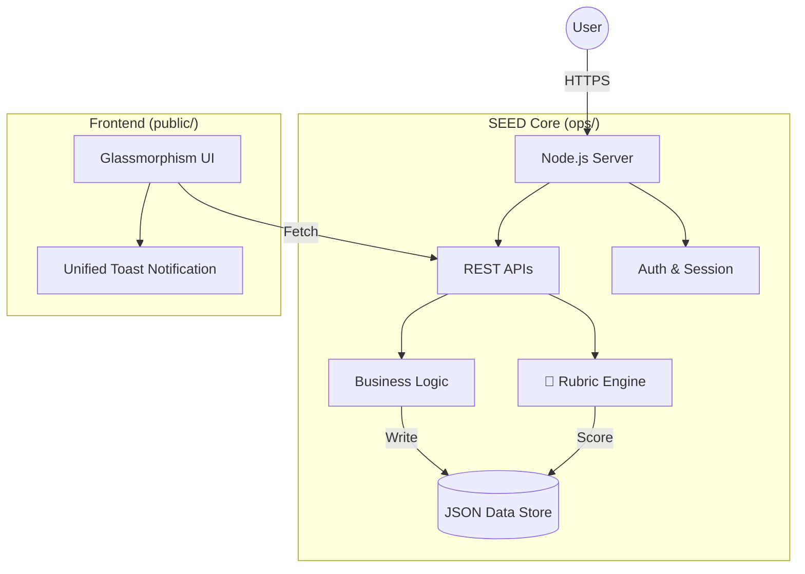

# 🌱 SEED v5.0: Evolution Protocol Edition

> **The Self-Evolving, Weaponized Development Kit.**
> *Generated by Ops OS Evolution Protocol | v5.0.0*

SEED v5.0 は、**「自律的な機能選択 (Weapon Selector)」** と **「自己進化 (Evolution Protocol)」** の両方を備えた最強の開発キットです。
v4.1の柔軟性と、v2.0プロジェクトから還流された**心理的安全性**・**没入型UI**が融合しています。

---

## 🌟 1. The Weaponry (装備と拡張性)
プロジェクトの特性に合わせて、最適な「武器」を選び取ってください。

### ⚔️ Weapon Selector (装備選定)
**"Don't carry what you don't need."**
プロジェクト開始時に、SEED自身（AIコンサルタント）が「このプロジェクトにはどの機能が必要か？」を診断し、最適な構成を提案します。
*   **Protocol**: `ops/WEAPON_SELECTOR.md`
*   **Impact**: 不要な機能を削ぎ落とし、最適な構成でスタートダッシュを切れます。

### 🌉 Manual AI Bridge (Serverless Option)
Node.jsサーバーを立てられない環境（Static Sites, GitHub Pages, Strictly Secured Environments）でも、クリップボード経由で高度なAI機能（Rubric等）を利用可能にするアーキテクチャです。

### 🛡️ Robust IO (RFC4180)
データ処理の堅牢性を強化。「たかがCSV」でプロジェクトを止めないよう、強力なRFC準拠パーサー (`ops/csv_utils.js`) を標準搭載しました。

---

## 🌟 2. Evolution Artifacts (v5.0 New Features)
実プロジェクト (Ippo Dashboard) から還流された、最新の戦術データです。

### 🛡️ Safe AI Simulation Patterns
ユーザーの不安を煽らず、前向きな行動変容を促すための「恐怖訴求禁止」「逃走歓迎」プロンプトパターン。
*   **Library**: `ops/PROMPT_LIBRARY.md` (Section 3)

### 🌅 Time-of-Day (TOD) Analysis
「いつ」行動したかを分析し、生活リズムに合った提案を行うためのロジック。
*   **Snippet**: `ops/snippets/log_analysis_tod.js`

### 💎 Glassmorphism UI System
Bento Gridレイアウトとネオンカラーを組み合わせた、モダンで没入感のあるCSSパターン。
*   **Snippet**: `ops/snippets/ui_patterns/glassmorphism.css`

### 🔥 Hobby Project Ecosystem (v5.1)
趣味プロジェクト向けの「熱量駆動」「完成→アイデア循環」システム。
*   **Heat System**: 締切ではなく「やりたさ」で優先度を決める
*   **Showcase Loop**: 完成→殿堂入り→AIアイデア生成→新プロジェクト
*   **Snippets**: `ops/snippets/hobby_patterns.md`, `ops/snippets/ui_patterns/auto_sync.md`
*   **Prompts**: `ops/PROMPT_LIBRARY.md` (Section 4)

---

## 🌟 3. The Core (Foundation)
どんな武器を選ぼうとも、揺るがない品質と堅牢性を提供します。

### 🧠 Rubric Engine (AI品質保証)
AIの回答を「雰囲気」で終わらせません。内蔵された審判AIが、全ての生成結果を3つの軸で数値化・監視します。
*   **Groundedness**: その回答は事実に即しているか？
*   **Safety**: 不適切な表現を含んでいないか？
*   **Tone**: ユーザーに寄り添った態度か？

### 🛡️ Enterprise Security First
開発初日から「本番品質」の守りを提供します。
*   **Secure Cookies**: `HttpOnly`, `SameSite=Strict` を標準装備。
*   **Session Management**: 堅牢なサーバーサイドセッション。
*   **Rate Limiting**: 攻撃予兆への防御準備完了。

### 🔩 Production Stability
「動く」だけでなく「止まらない・壊れない」仕組み。
*   **Graceful Shutdown**: 処理中のデータを守る安全な停止ロジック。
*   **Health Check**: 外部監視システムと即連携可能な `/api/health`。
*   **Integrity Scans**: 起動ごとのデータ破損チェック。

---

## 🏗️ Architecture



## 📂 Directory Structure

| Path | Description |
|---|---|
| `ops/` | **サーバーサイド & AIロジック** |
| ├── `rubric_engine.js` | ★ AI品質評価エンジン |
| ├── `server.js` | ★ セキュリティ強化済みサーバー |
| ├── `analyze_patterns.js` | ナレッジ分析ロジック |
| ├── `snippets/` | ★ **汎用スニペット (New)** |
| │   ├── `log_analysis_tod.js` | 時間帯分析ロジック |
| │   └── `ui_patterns/` | UIデザインパターン |
| `public/` | **フロントエンド** |
| ├── `js/utils.js` | ★ 共通UI (Toast, Logout) |
| ├── `dashboard_*.html` | ロール別ダッシュボード (PM, SV, OP) |
| `data/` | **データストア** (JSON形式, 自動バックアップ) |
| `docs/` | ドキュメント、マニュアル類 |

---

## 🚀 Getting Started

### 1. Install Dependencies
```bash
npm install
```

### 2. Configure Environment
`ops/.env.example` をコピーして `.env` を作成してください（必要に応じて）。
defaultValue: `PORT=8083`
*   **Auto-Port**: `8083` が使用中の場合、自動的に `8084`, `8085`... と空きポートを探して起動します。
*   **Manual**: 固定したい場合は `.env` で `PORT=9000` のように指定してください。

### 3. Start Server
```bash
npm start
```
アクセス: `http://localhost:8083`

### 4. Development Workflow
1.  **Define**: `SEED_GUIDE.md` を読み、作りたいアプリの構成を練る。
2.  **Plan**: `PROJECT_PLAN_TEMPLATE.md` で計画を立てる。
3.  **Build**: `public/` 内のHTMLを編集してUIを作る。
4.  **Evolve**: 運用しながらデータ（`data/*.json`）を蓄積し、Rubric Engineで品質を高める。

---

## 📚 Documentation
*   [SEED_GUIDE.md](./SEED_GUIDE.md) - 詳細なコンセプトとガイド
*   [CHANGELOG.md](./CHANGELOG.md) - バージョン履歴
*   [DEPLOYMENT.md](./DEPLOYMENT.md) - 本番デプロイ手順

---

> **"End with a Seed."** - 終わりは、次の始まりです。

**Powered by Antigravity Agent**
